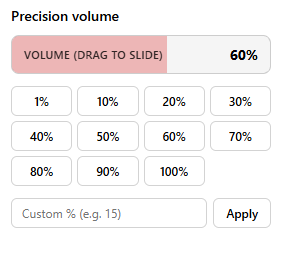

# YouTube Precision Volume

A lightweight Chrome extension to set the volume of YouTube videos with fine precision. Choose preset levels, type a custom percentage, or simply click and drag across the volume bar.

  

## Features

- Click and drag volume scrubbing: Slide horizontally across the volume bar to adjust volume smoothly in real time.
- Quick presets: Jump straight to 1%, 10%, 20%, 30%, 40%, 50%, 60%, 70%, 80%, 90%, or 100%.
- Custom precision percentage: Enter any decimal percentage (e.g. 15.5%).
- Volume persistence: Synchronizes with YouTube's player and storage so volume settings do not reset automatically.

## Installation

1. Open `chrome://extensions` in Chrome.
2. Enable **Developer mode** (top right).
3. Click **Load unpacked** and select this folder.

## Usage

Open any YouTube video, click the extension icon in your toolbar, and adjust the volume using presets, custom input, or by dragging the volume bar.

## License

[MIT](LICENSE)
